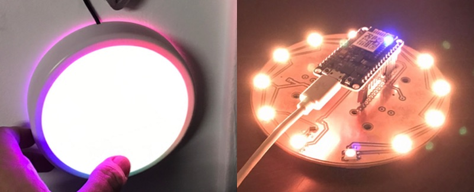
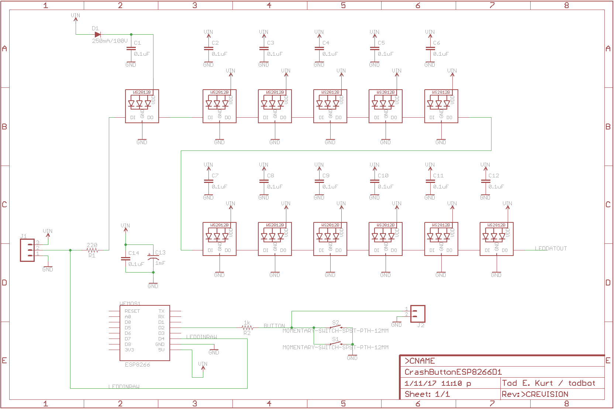
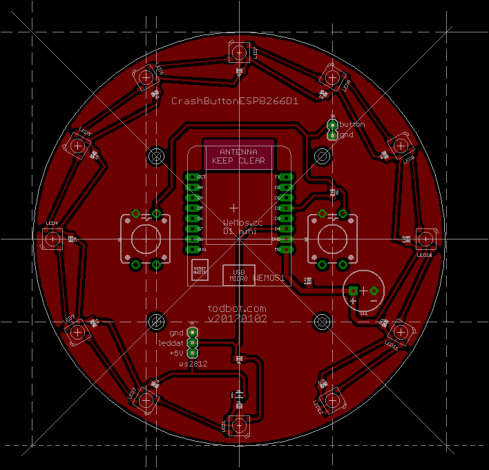
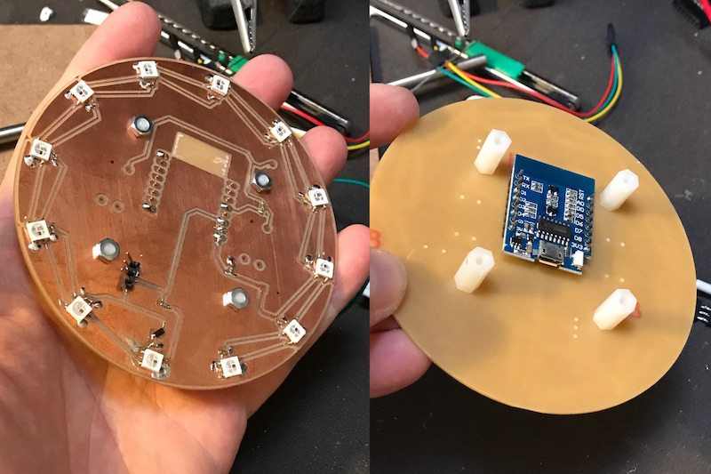
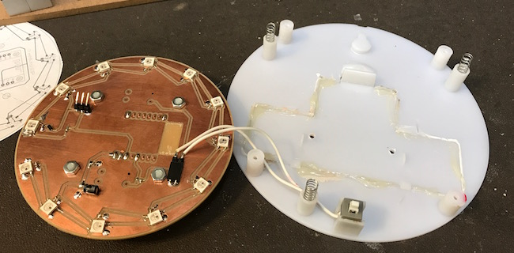

# crashspace-bigbutton

Firmware and schematics for the [CrashSpace](https://blog.crashspace.org/)
"BigButton" hardware interface to https://crashspacela.com/sign/



At [CrashSpace](https://blog.crashspace.org/) we have a publicly-viewable
"sign" at https://crashspacela.com/sign/ to let members know when the
space is open. This sign page is updated by a big button in the front
room.  Press it, the sign webpage updates, and you've promised to be
in the space for an hour.

This repo is documentation of the new BigButton hardware that was installed
at CrashSpace in Jan 2017.

## Functionality

* The BigButton consists of a pushbutton and a ring of LEDs
* The user pushes the button to signify they're at the space
* The LED ring displays whether or not CrashSpace is "open" or "closed"
* The LED ring visually shows a count down from 60 minutes,
  giving a rough indication of time left
* Pushing the button sends an HTTP request to the CrashSpace "sign" server
   at https://crashspacela.com/sign/
* (new!) The button periodically fetches a JSON feed from the
  sign server, getting time left and whether space is open or not.
  This allows for multiple buttons.

## In use

  * Button is pulsing ORANGE: CrashSpace is closed
  * Push Button.  Button spins a RAINBOW for a second or two, then
  * Button is pulsing TEAL: CrashSpace is open
  * Button counts down my extinguishing TEAL LEDs in an arc
  * Button flashing RED: Internet is down

## Implementation

The original BigButton implementation was an Arduino Uno with WS2812 LEDs inside a
large taplight tied to a Linux netbook for WiFi connectivity.
An upgrade button created several years late used an early version of the
Particle Photon Internet Button kit in a custom 3d printed enclosure.

This version of BigButton uses an
[ESP82166 Wemos D1 mini](https://www.wemos.cc/product/d1-mini.html)
WiFi board mounted to a custom carrier board containing 12 WS2812 LEDs.
It uses the [ESP8266 Arduino core](https://github.com/esp8266/Arduino/)
to run an Arduino sketch.


### Implementation - Hardware

The hardware implementation is pretty straight forward.
The Wemos D1 mini ESP8266 board does all the work.
The input is a single button and the output is a string of WS2812 LEDs.

The schematic and layout for the carrier board is:




Eagle format versions of these are in the [schematic](./schematic) folder.

#### Converting 3v3 ESP8266 output for WS2812 / Neopixel  LEDs

One interesting thing about the schematic how the ESP8266 (a 3v3 device)
manages to control 5V WS2812/Neopixel LEDs.  Some WS2812s can be driven by 3v3 logic HIGH, but it's iffy.  The standard solution is a level-shifter buffer to convert 3v3 HIGH to 5V HIGH.

The technique used on this board, however, is to create a "sacrificial" LED that powered not by 5V but by a stepped-down voltage from a standard signal diode
(with its 0.7V voltage drop).  This creates an approx. 4.3V power source that is high enough to drive the LED but brings its concept of logic HIGH (>70% of Vcc) down to what a 3v3 device will output.  Basically, we're building a
special intermediary power supply for a single LED.
The rest of the WS2812 LEDs are driven by 5V.

#### Othermill design considerations

I wanted this board to be millable on an Othermill, so that meant adopting slightly different PCB design techniques.  There are a few reasons for this. For instance, because this board has no soldermask, I want to maximize spacing between copper traces.  Also, I would like to minimize the use of endmills smaller than 1/32" because they are fragile and take a long time to mill.  Thus, the techniques I use are:

* Increase trace width 16 mil (0.016")
* Add ground plane, set its Polygon->Isolate value to 32 mil (0.032")
* Single-sided only design (or minimize back-side traces)
* Space components out to enable easy soldering

The result is below. The Wemos D1 Mini ESP8266 board is mounted on the
backside of the board to minimize its impact on light output.  
The board is mounted on standoffs which are screwed into the modified
taplight. The taplight's switch is reused as the button input.






### Implementation - Firmware

The ESP8266 runs the ["CrashButtonESP"](./CrashButtonESP/) Arduino sketch.

#### ArduinoJson is awesome

The sketch relies on the ArduinoJson library.
With it you can easily parse and use JSON data structures.
And with its magical use of C++ operator-overloading you can have code
like this:

```c++
// jsonstr = '{"is_open":false,"minutes_left":-920.45,"button_presses":[]}'
JsonObject& root = jsonBuffer.parseObject(jsonstr);
bool is_open        = root["is_open"];
double minutes_left = root["minutes_left"];
```

#### CrashSpace sign server JSON API

To enable the button to report real open status
(and not just a dumb countdown), the sign server API at
https://crashspacela.com/sign/
has been updated with a JSON output mode.  There are two versions
of JSON output, picked with the `output` query arg:
* `jsonmin` - "minimal" version with just open status and minutes left
* `json`  - full version that gives a list of recent button presses

The Button uses the minimal one.  Both are shown below:

```json
% curl 'https://crashspacela.com/sign/?output=jsonmin'
{"is_open":false,"minutes_left":-920.45,"button_presses":[]}
```

```json
% curl 'https://crashspacela.com/sign/?output=json'
{
    "is_open": false,
    "minutes_left": -919.43333333333,
    "button_presses": [
        {
            "type": "update",
            "id": "crashbutton1",
            "msg": "Someone is at the space!",
            "diff_mins_max": 60,
            "description": "crashbutton1 - update - 60 mins.",
            "date": "Wed, 11 Jan 2017 21:38:03 -0800",
            "date_epoch": "1484199483"
        },
        {
            "type": "update",
            "id": "crashbutton1",
            "msg": "Someone is at the space!",
            "diff_mins_max": 60,
            "description": "crashbutton1 - update - 60 mins.",
            "date": "Wed, 11 Jan 2017 20:00:00 -0800",
            "date_epoch": "1484193600"
        },
        {
            "type": "update",
            "id": "crashbutton1",
            "msg": "Someone is at the space!",
            "diff_mins_max": 60,
            "description": "crashbutton1 - update - 60 mins.",
            "date": "Wed, 11 Jan 2017 19:16:26 -0800",
            "date_epoch": "1484190986"
        }
    ]
}
```
